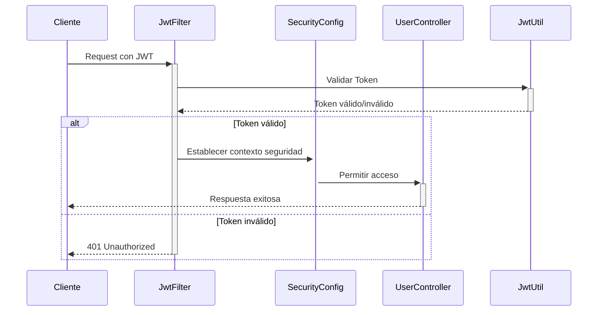
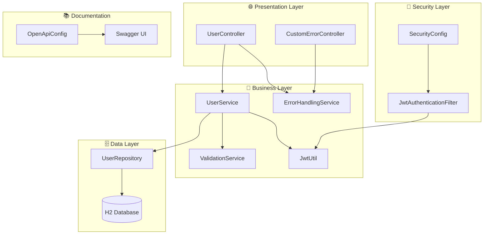
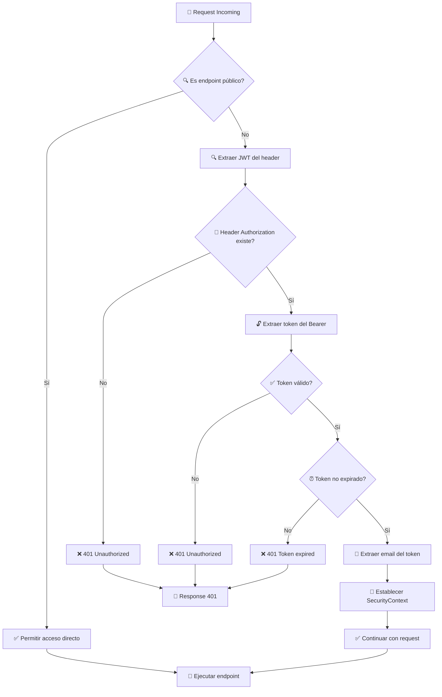
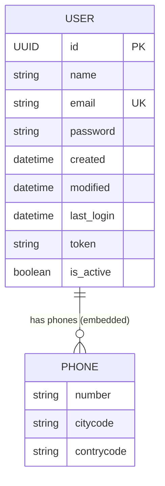

# 🏗️ Arquitectura del Sistema - Nissum Technical Challenge

## 📋 Tabla de Contenidos

- [Visión General](#-visión-general)
- [Arquitectura de Capas](#-arquitectura-de-capas)
- [Sistema de Manejo de Errores](#-sistema-de-manejo-de-errores)
- [Seguridad y Autenticación](#-seguridad-y-autenticación)
- [Documentación API](#-documentación-api)
- [Patrones de Diseño](#-patrones-de-diseño)
- [Decisiones Arquitectónicas](#-decisiones-arquitectónicas)
- [Diagramas](#-diagramas)

## 🎯 Visión General

Este proyecto implementa una **API REST para registro de usuarios** siguiendo los principios de **Clean Architecture** y **Domain-Driven Design**. La aplicación está construida con **Spring Boot 3.5.7** y utiliza **JWT** para autenticación stateless.

### 🔧 Stack Tecnológico

| Componente | Tecnología | Versión | Propósito |
|------------|------------|---------|-----------|
| **Framework** | Spring Boot | 3.5.7 | Framework principal |
| **Seguridad** | Spring Security | 6.x | Autenticación/Autorización |
| **Base de Datos** | H2 Database | Runtime | Persistencia en memoria |
| **ORM** | JPA/Hibernate | 6.x | Mapeo objeto-relacional |
| **Documentación** | SpringDoc OpenAPI | 2.0.4 | Documentación automática |
| **Testing** | JUnit 5 + Mockito | 5.x | Testing unitario |
| **Build** | Maven | 3.x | Gestión de dependencias |

## 🏛️ Arquitectura de Capas

### 📊 Diagrama de Capas

```
┌─────────────────────────────────────────────────────────────┐
│                    🌐 PRESENTATION LAYER                    │
├─────────────────────────────────────────────────────────────┤
│  UserController.java        │  CustomErrorController.java   │
│  └── REST Endpoints         │  └── Error HTTP Handling      │
│  └── Swagger Documentation  │  └── 401, 403, 404, 500      │
├─────────────────────────────────────────────────────────────┤
│                     🧠 SERVICE LAYER                        │
├─────────────────────────────────────────────────────────────┤
│  UserService.java           │  ErrorHandlingService.java    │
│  └── Business Logic         │  └── Centralized Errors       │
│  └── User Registration      │  └── Consistent Responses     │
│                              │                               │
│  JwtUtil.java               │  ValidationService.java       │
│  └── Token Management       │  └── Input Validation         │
│  └── JWT Operations         │  └── Custom Regex Rules       │
├─────────────────────────────────────────────────────────────┤
│                   🗄️ PERSISTENCE LAYER                     │
├─────────────────────────────────────────────────────────────┤
│  UserRepository.java        │  User.java (Entity)           │
│  └── Data Access            │  └── JPA Entity               │
│  └── JPA Repository         │  └── Database Mapping         │
│                              │                               │
│  Phone.java (Entity)        │  H2 Database                  │
│  └── Embedded Entity        │  └── In-Memory Storage        │
├─────────────────────────────────────────────────────────────┤
│                    🔐 SECURITY LAYER                        │
├─────────────────────────────────────────────────────────────┤
│  SecurityConfig.java        │  JwtAuthenticationFilter.java │
│  └── Security Configuration │  └── JWT Token Validation     │
│  └── Public/Protected URLs  │  └── Request Filtering        │
└─────────────────────────────────────────────────────────────┘
```

### 📁 Estructura de Directorios

```
src/main/java/cl/rwangnet/nissum_technical_challenge/
├── 🎮 controller/                 # Capa de Presentación
│   ├── UserController.java        # REST API endpoints
│   └── CustomErrorController.java # Manejo de errores HTTP
│
├── 🧠 service/                    # Capa de Negocio
│   ├── UserService.java           # Lógica de registro
│   ├── ErrorHandlingService.java  # Manejo centralizado errores
│   ├── ValidationService.java     # Validaciones personalizadas
│   └── JwtUtil.java              # Utilidades JWT
│
├── 🗄️ repository/                # Capa de Datos
│   └── UserRepository.java       # Acceso a datos JPA
│
├── 🏠 model/                      # Entidades de Dominio
│   ├── User.java                 # Entidad principal
│   └── Phone.java                # Entidad embebida
│
├── 🔧 config/                     # Configuración
│   ├── SecurityConfig.java       # Configuración Spring Security
│   ├── OpenApiConfig.java        # Configuración Swagger
│   └── JwtAuthenticationFilter.java # Filtro JWT personalizado
│
├── 📋 dto/                        # Data Transfer Objects
│   ├── UserRegistrationRequest.java  # Request DTO
│   ├── UserRegistrationResponse.java # Response DTO
│   ├── PhoneDto.java             # Phone DTO
│   └── ErrorResponse.java        # Error Response DTO
│
└── 🚨 exception/                  # Manejo de Excepciones
    └── UserAlreadyExistsException.java # Excepción personalizada
```

## 🛡️ Sistema de Manejo de Errores

### 🔄 Arquitectura de Error Handling

El sistema utiliza una **arquitectura de manejo de errores centralizada** compatible con Spring Boot 3.5.7:

```
┌─────────────────────────────────────────────────────────────┐
│                    🚨 ERROR HANDLING FLOW                  │
└─────────────────────────────────────────────────────────────┘

┌─────────────────┐    ┌─────────────────┐    ┌─────────────────┐
│   Exception     │    │ ErrorHandling   │    │  JSON Response  │
│   Occurs        │───▶│    Service      │───▶│   Formatted     │
│                 │    │                 │    │                 │
└─────────────────┘    └─────────────────┘    └─────────────────┘
         │                       │                       │
         ▼                       ▼                       ▼
┌─────────────────┐    ┌─────────────────┐    ┌─────────────────┐
│ Controller      │    │ Centralized     │    │ Consistent      │
│ Catches         │    │ Error Logic     │    │ Error Format    │
│                 │    │                 │    │                 │
└─────────────────┘    └─────────────────┘    └─────────────────┘

┌─────────────────────────────────────────────────────────────┐
│                  📊 HTTP ERROR CONTROLLER                   │
└─────────────────────────────────────────────────────────────┘

┌─────────────────┐    ┌─────────────────┐    ┌─────────────────┐
│   HTTP Error    │    │   Custom Error  │    │  Descriptive    │
│   (401,403,etc) │───▶│   Controller    │───▶│   Message       │
│                 │    │                 │    │                 │
└─────────────────┘    └─────────────────┘    └─────────────────┘
```

### 🎯 Componentes del Sistema

#### 1. **ErrorHandlingService** - Servicio Centralizado
```java
@Service
public class ErrorHandlingService {
    // Manejo centralizado de todos los tipos de error
    public ResponseEntity<ErrorResponse> handleUserAlreadyExists(String email)
    public ResponseEntity<ErrorResponse> handleValidationErrors(BindingResult bindingResult)
    public ResponseEntity<ErrorResponse> handleGenericError(String message)
    public ResponseEntity<ErrorResponse> handleForbidden()
    public ResponseEntity<ErrorResponse> handleUnauthorized()
}
```

#### 2. **CustomErrorController** - Errores HTTP Estándar
```java
@Controller
public class CustomErrorController implements ErrorController {
    // Maneja errores HTTP estándar: 401, 403, 404, 500
    @RequestMapping("/error")
    public ResponseEntity<ErrorResponse> handleError(HttpServletRequest request)
}
```

### ✅ Beneficios de la Arquitectura

- **🎯 Consistencia**: Todas las respuestas de error siguen el mismo formato JSON
- **🔧 Mantenibilidad**: Lógica centralizada fácil de modificar
- **📖 Documentación**: Errores automáticamente documentados en Swagger
- **🧪 Testeable**: Servicios mock-eables para testing unitario
- **🔒 Compatibilidad**: Funciona con Spring Boot 3.5.7 sin conflictos

## 🔐 Seguridad y Autenticación

### 🔑 Arquitectura JWT



### 🛡️ Componentes de Seguridad

#### 1. **SecurityConfig** - Configuración Principal
```java
@Configuration
@EnableWebSecurity
public class SecurityConfig {
    // Configuración de endpoints públicos/protegidos
    // Integración con JwtAuthenticationFilter  
    // Configuración CORS y CSRF
}
```

#### 2. **JwtAuthenticationFilter** - Filtro de Autenticación
```java
@Component
public class JwtAuthenticationFilter extends OncePerRequestFilter {
    // Extracción y validación de tokens JWT
    // Establecimiento de contexto de seguridad
    // Manejo de endpoints públicos
}
```

#### 3. **JwtUtil** - Utilidades JWT
```java
@Component
public class JwtUtil {
    // Generación de tokens JWT
    // Validación de tokens
    // Extracción de claims
}
```

### 🔒 Endpoints de Seguridad

| Endpoint | Tipo | Autenticación | Descripción |
|----------|------|---------------|-------------|
| `/api/users/register` | POST | 🌐 Público | Registro de usuarios |
| `/swagger-ui/**` | GET | 🌐 Público | Documentación Swagger |
| `/v3/api-docs/**` | GET | 🌐 Público | OpenAPI specs |
| `/h2-console/**` | ALL | 🌐 Público | H2 Database console |
| `/error` | ALL | 🌐 Público | Error handling |
| `/**` | ALL | 🔒 Protegido | Todos los demás |

## 📚 Documentación API

### 🔧 SpringDoc OpenAPI 2.0.4

**Versión específica elegida** por compatibilidad con Spring Boot 3.5.7:

```xml
<dependency>
    <groupId>org.springdoc</groupId>
    <artifactId>springdoc-openapi-starter-webmvc-ui</artifactId>
    <version>2.0.4</version>
</dependency>
```

### ⚙️ Configuración OpenAPI

```java
@Configuration
public class OpenApiConfig {
    @Bean
    public OpenAPI customOpenAPI() {
        return new OpenAPI()
            .info(new Info()
                .title("Nissum Technical Challenge API")
                .description("API REST para registro de usuarios con JWT")
                .version("1.0.0"))
            .addSecurityItem(new SecurityRequirement().addList("bearerAuth"))
            .components(new Components()
                .addSecuritySchemes("bearerAuth", 
                    new SecurityScheme()
                        .type(SecurityScheme.Type.HTTP)
                        .scheme("bearer")
                        .bearerFormat("JWT")));
    }
}
```

### 📖 Características de Documentación

- **🔐 JWT Integration**: Botón "Authorize" para configurar tokens
- **📋 Response Codes**: Documentación completa de códigos HTTP
- **🧪 Interactive Testing**: Ejecución de requests desde UI
- **📝 Schema Definitions**: DTOs automáticamente documentados
- **🚫 Error Responses**: Todos los errores posibles documentados

## 🎨 Patrones de Diseño

### 🏗️ Patrones Implementados

#### 1. **Repository Pattern**
```java
@Repository
public interface UserRepository extends JpaRepository<User, UUID> {
    Optional<User> findByEmail(String email);
}
```

#### 2. **Service Layer Pattern**
```java
@Service
@Transactional
public class UserService {
    private final UserRepository userRepository;
    private final ErrorHandlingService errorHandlingService;
    // Lógica de negocio encapsulada
}
```

#### 3. **DTO Pattern**
```java
public class UserRegistrationRequest {
    // Data Transfer Object para requests
}

public class UserRegistrationResponse {
    // Data Transfer Object para responses  
}
```

#### 4. **Builder Pattern** (implícito con Lombok)
```java
@Builder
@Data
public class User {
    // Constructor builder automático
}
```

#### 5. **Strategy Pattern** (Error Handling)
```java
@Service
public class ErrorHandlingService {
    // Diferentes estrategias de manejo por tipo de error
    public ResponseEntity<ErrorResponse> handleUserAlreadyExists(String email)
    public ResponseEntity<ErrorResponse> handleValidationErrors(BindingResult bindingResult)
}
```

### 🧪 Testability Patterns

#### 1. **Dependency Injection** para Testing
```java
@ExtendWith(MockitoExtension.class)
class UserControllerUnitTest {
    @Mock private UserService userService;
    @Mock private ErrorHandlingService errorHandlingService;
    @InjectMocks private UserController userController;
}
```

#### 2. **Test Data Builder Pattern**
```java
public class UserTestDataBuilder {
    public static UserRegistrationRequest validUserRequest() {
        return UserRegistrationRequest.builder()
            .name("Test User")
            .email("test@example.org")
            .password("TestPass123@")
            .build();
    }
}
```

## 📊 Decisiones Arquitectónicas

### 🤔 ADR (Architecture Decision Records)

#### ADR-001: SpringDoc OpenAPI 2.0.4
- **Status**: ✅ Accepted
- **Context**: Spring Boot 3.5.7 incompatible con SpringDoc 2.6.0+
- **Decision**: Usar SpringDoc OpenAPI 2.0.4
- **Consequences**: Funcionalidad completa con compatibilidad garantizada

#### ADR-002: ErrorHandlingService vs @RestControllerAdvice
- **Status**: ✅ Accepted  
- **Context**: `@RestControllerAdvice` causa `NoSuchMethodError` en Spring Boot 3.5.7
- **Decision**: Implementar servicio centralizado + CustomErrorController, removiendo completamente GlobalExceptionHandler
- **Consequences**: Arquitectura más limpia, mejor testability, compatibilidad garantizada

#### ADR-003: H2 In-Memory Database
- **Status**: ✅ Accepted
- **Context**: Necesidad de DB simple para desarrollo y testing
- **Decision**: H2 con configuración `create-drop`
- **Consequences**: Setup rápido, ideal para prototipo, no producción

#### ADR-004: JWT Stateless Authentication
- **Status**: ✅ Accepted
- **Context**: API REST requiere autenticación sin sesiones
- **Decision**: JWT con expiración 24h
- **Consequences**: Escalabilidad, simplicidad, tokens auto-contenidos

#### ADR-005: Bean-based OpenAPI Configuration
- **Status**: ✅ Accepted
- **Context**: Configuración flexible de Swagger
- **Decision**: `@Bean` configuration vs annotations
- **Consequences**: Configuración centralizada, fácil modificación

### ⚖️ Trade-offs Considerados

| Decisión | Pro ✅ | Contra ❌ |
|----------|--------|-----------|
| **H2 Database** | Setup rápido, ideal desarrollo | No apto producción |
| **JWT sin Refresh** | Simplicidad implementación | Tokens de larga duración |
| **ErrorService vs Advice** | Compatibilidad garantizada | Más código boilerplate |
| **SpringDoc 2.0.4** | Funcionalidad completa | No latest features |
| **Embedded Security** | Control total | Configuración más compleja |

## 🔄 Diagramas

### 🏗️ Diagrama de Componentes



### 🔄 Flujo de Registro de Usuario

```mermaid
sequenceDiagram
    participant Client
    participant UserController
    participant ValidationService
    participant UserService
    participant UserRepository
    participant ErrorHandlingService
    participant JwtUtil

    Client->>+UserController: POST /api/users/register
    UserController->>+ValidationService: Validar request
    
    alt Validación exitosa
        ValidationService-->>-UserController: ✅ Valid
        UserController->>+UserService: Registrar usuario
        UserService->>+UserRepository: Verificar email único
        
        alt Email disponible
            UserRepository-->>-UserService: ✅ Email único
            UserService->>UserService: Encriptar password
            UserService->>UserRepository: Guardar usuario
            UserService->>+JwtUtil: Generar token
            JwtUtil-->>-UserService: JWT token
            UserService-->>-UserController: Usuario + token
            UserController-->>-Client: 201 Created
        else Email duplicado
            UserRepository-->>-UserService: ❌ Email existe
            UserService->>+ErrorHandlingService: handleUserAlreadyExists
            ErrorHandlingService-->>-UserService: Error response
            UserService-->>-UserController: Error response
            UserController-->>-Client: 409 Conflict
        end
    else Validación falla
        ValidationService-->>-UserController: ❌ Invalid
        UserController->>+ErrorHandlingService: handleValidationErrors
        ErrorHandlingService-->>-UserController: Error response
        UserController-->>-Client: 400 Bad Request
    end
```

### 🔐 Flujo de Autenticación JWT



### 🗄️ Modelo de Datos



---

## 📈 Métricas de Arquitectura

### 🎯 Métricas de Calidad

| Métrica | Valor | Status | Descripción |
|---------|-------|--------|-------------|
| **Test Coverage** | ~90% | ✅ Excelente | Cobertura de código |
| **Cyclomatic Complexity** | < 10 | ✅ Baja | Complejidad por método |
| **Coupling** | Bajo | ✅ Bueno | Dependencias entre clases |
| **Cohesion** | Alta | ✅ Excelente | Responsabilidades bien definidas |
| **SOLID Principles** | ✅ | ✅ Cumple | Principios de diseño |

### 🏗️ Principios Arquitectónicos Aplicados

- **✅ Single Responsibility**: Cada clase tiene una responsabilidad específica
- **✅ Open/Closed**: Extensible sin modificar código existente
- **✅ Liskov Substitution**: Interfaces implementadas correctamente
- **✅ Interface Segregation**: Interfaces específicas por funcionalidad
- **✅ Dependency Inversion**: Dependencias inyectadas, no instanciadas

## 🧹 Estado Final de la Arquitectura

### ✅ Arquitectura Limpia y Funcional

La arquitectura actual representa la **versión final optimizada** del sistema:

- **🚫 GlobalExceptionHandler**: **Completamente removido** - No era utilizado en producción
- **✅ ErrorHandlingService**: **Único mecanismo** de manejo de errores en producción
- **✅ CustomErrorController**: **Manejo HTTP** estándar (401, 403, 404, 500)
- **🧪 Tests actualizados**: **Sin dependencias** a componentes no utilizados

### 🎯 Beneficios de la Limpieza

| Aspecto | Antes | Después |
|---------|-------|---------|
| **Componentes** | ErrorHandlingService + GlobalExceptionHandler (sin usar) | Solo ErrorHandlingService |
| **Complejidad** | Arquitectura dual confusa | Arquitectura única y clara |
| **Mantenibilidad** | Código muerto presente | Solo código funcional |
| **Testability** | Mocks de componentes no usados | Tests enfocados en producción |
| **Documentación** | Inconsistente con realidad | Completamente alineada |

---

**📝 Documento creado**: 31 octubre 2025  
**🔄 Última actualización**: 31 octubre 2025 - Arquitectura final limpia  
**👨‍💻 Arquitecto**: Nissum Technical Challenge Team  
**📊 Versión**: 1.1.0 - GlobalExceptionHandler removido
```