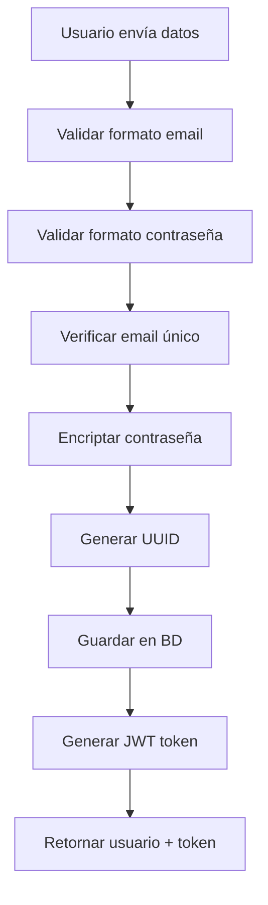
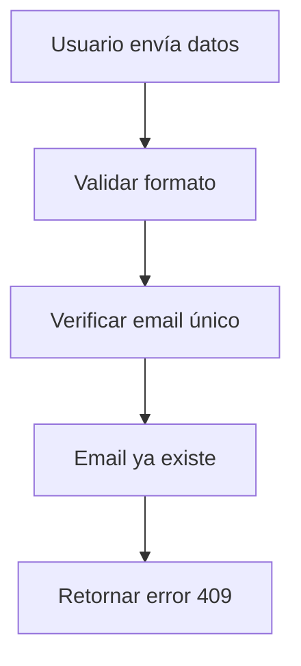
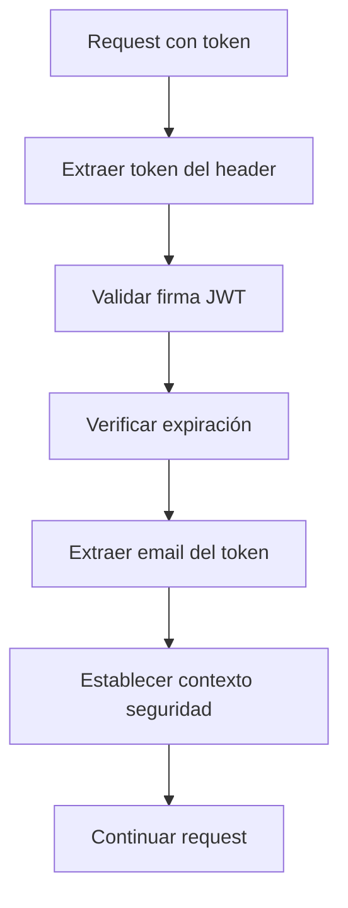

# 🚀 Nissum Technical Challenge - API de Creación de Usuarios con JWT

## 📋 Descripción

API RESTful desarrollada en Spring Boot para la creación de usuarios con autenticación JWT, implementando todas las especificaciones del desafío técnico de Nissum. La aplicación incluye validaciones robustas, seguridad completa y una arquitectura escalable.

## 🛠️ Tecnologías Utilizadas

- **Java 17** - Lenguaje de programación
- **Spring Boot 3.5.7** - Framework principal
- **Spring Data JPA** - Persistencia de datos
- **Spring Security** - Seguridad y autenticación
- **H2 Database** - Base de datos en memoria
- **JWT (JSON Web Tokens)** - Sistema de autenticación
- **Swagger/OpenAPI 3** - Documentación interactiva
- **Lombok** - Reducción de código boilerplate
- **JUnit 5 & Mockito** - Framework de testing
- **Maven** - Gestión de dependencias y build

## 🏗️ Arquitectura del Proyecto

El proyecto implementa una **arquitectura en capas** con separación clara de responsabilidades:

```
📁 src/main/java/cl/rwangnet/nissum_technical_challenge/
├── 🎮 controller/          # Controladores REST (API endpoints)
│   └── UserController.java
├── 🔧 service/            # Lógica de negocio
│   ├── UserService.java
│   └── ErrorHandlingService.java
├── 💾 repository/         # Acceso a datos (JPA repositories)
│   ├── UserRepository.java
│   └── PhoneRepository.java
├── 📊 model/              # Entidades JPA (modelo de datos)
│   ├── User.java
│   └── Phone.java
├── 📦 dto/                # Objetos de transferencia de datos
│   ├── UserRegistrationRequest.java
│   ├── PhoneRequest.java
│   ├── UserResponse.java
│   ├── PhoneResponse.java
│   └── ErrorResponse.java
├── ⚙️ config/             # Configuraciones de Spring
│   ├── SecurityConfig.java
│   ├── OpenApiConfig.java
│   └── CustomErrorController.java
├── 🚨 exception/          # Manejo de errores y excepciones
│   └── UserAlreadyExistsException.java
├── 🔒 filter/             # Filtros de seguridad
│   └── JwtAuthenticationFilter.java
└── 🛡️ util/               # Utilidades (JWT management)
    └── JwtUtil.java

📁 src/test/java/cl/rwangnet/nissum_technical_challenge/
├── 🧪 controller/         # Tests de controladores
├── 🧪 service/           # Tests de servicios
├── 🧪 security/          # Tests de seguridad JWT
└── 🧪 integration/       # Tests de integración completa
```

## ✨ Características Implementadas

### 🎯 Funcionalidades Principales
- ✅ **Registro de usuarios** con validaciones completas
- ✅ **Generación automática de UUID** para identificadores únicos
- ✅ **Sistema JWT completo** (generación, validación, refresh)
- ✅ **Validaciones configurables** de email y contraseña via regex
- ✅ **Base de datos H2** en memoria con consola web
- ✅ **Manejo de errores** consistente en formato JSON
- ✅ **Documentación interactiva** con Swagger UI
- ✅ **Arquitectura escalable** con separación de capas

### 🔍 Sistema de Validaciones
- **📧 Email**: Formato válido según regex configurable
  ```
  Patrón por defecto: ^[a-zA-Z0-9._%+-]+@[a-zA-Z0-9.-]+\.[a-zA-Z]{2,}$
  ```
- **🔐 Contraseña**: Validación robusta configurable
  ```
  Patrón por defecto: Mínimo 8 caracteres, mayúscula, minúscula, número y carácter especial
  ```
- **📋 Campos obligatorios**: Nombre, email, contraseña y al menos un teléfono
- **🚫 Email único**: Prevención de duplicados con validación en BD

### 🛡️ Sistema de Seguridad JWT
- **🔒 Encriptación BCrypt** para contraseñas (salt automático)
- **🎫 Tokens JWT** con expiración configurable (24h por defecto)
- **🔑 Clave secreta** configurable para signing de tokens
- **🚪 Filtro de autenticación** automático para endpoints protegidos
- **🧹 Manejo de contexto** de seguridad de Spring Security
- **💾 Almacenamiento en BD** para demostración (ver nota de diseño)

> **📝 Nota de Diseño**: En este proyecto se almacenan los tokens JWT en base de datos para cumplir con los requisitos del challenge y permitir funcionalidades como revocación de tokens. En producción, se recomienda evaluar un enfoque stateless puro o híbrido con refresh tokens para mejor escalabilidad.

### 🔧 Sistema de Manejo de Errores Mejorado
- **🎯 ErrorHandlingService**: Servicio centralizado para manejo consistente de errores
- **🚪 CustomErrorController**: Manejo de errores HTTP estándar (401, 403, 404, 500)
- **🔗 Compatibilidad Spring Boot 3.5.7**: Solución alternativa a @ControllerAdvice
- **📝 Mensajes descriptivos**: Respuestas de error claras y específicas
- **🔒 Integración con JWT**: Manejo específico de errores de autenticación
- **📖 Documentación Swagger**: Errores documentados en OpenAPI spec

> **🔧 Nota Técnica**: Se implementó una arquitectura alternativa de manejo de errores debido a incompatibilidades del `@RestControllerAdvice` con Spring Boot 3.5.7. La solución utiliza `ErrorHandlingService` centralizado + `CustomErrorController` para mantener consistencia sin comprometer la funcionalidad.

### 🧪 Cobertura de Testing (46 tests totales)
- **✅ Tests unitarios** para servicios y utilidades (18+ tests)
- **✅ Tests de integración** para controladores (10+ tests)
- **✅ Tests de seguridad JWT** completos (9+ tests)
  - JwtUtilTest (18 tests): Generación, validación, expiración
  - JwtAuthenticationFilterTest (9 tests): Filtros y autenticación
  - SecurityConfigTest (10 tests): Configuración y encoding
- **✅ Tests end-to-end** con base de datos real
- **✅ Tests de manejo de errores** actualizados
- **✅ Cobertura de casos edge** y validaciones

### 📚 Documentación y Monitoreo
- **📖 Swagger UI** para pruebas interactivas
- **🔍 OpenAPI 3** specification completa
- **💊 Health checks** con Spring Boot Actuator
- **📊 Métricas** de aplicación disponibles

## 🚀 Instalación y Ejecución

### 📋 Prerrequisitos
- ☕ **Java 17** o superior
- 📦 **Maven 3.6** o superior
- 🌐 **Navegador web** (para Swagger UI y H2 console)

### 🔧 Pasos de Instalación

1. **📥 Clonar el repositorio**:
```bash
git clone https://github.com/rwangnet/nissum_tech_challenge.git
cd nissum_tech_challenge
```

2. **🏗️ Compilar el proyecto**:
```bash
./mvnw clean compile
```

3. **🧪 Ejecutar todos los tests**:
```bash
./mvnw test
```

4. **🚀 Ejecutar la aplicación**:
```bash
./mvnw spring-boot:run
```

### 🌐 URLs de Acceso

Una vez iniciada la aplicación:

| Servicio | URL | Descripción |
|----------|-----|-------------|
| 🏠 **API Principal** | http://localhost:8080 | Endpoint base de la API |
| 📖 **Swagger UI** | http://localhost:8080/swagger-ui/index.html | Documentación interactiva |
| 💾 **H2 Console** | http://localhost:8080/h2-console | Consola de base de datos |
| 📊 **Health Check** | http://localhost:8080/actuator/health | Estado de la aplicación |
| 📈 **Métricas** | http://localhost:8080/actuator/metrics | Métricas de rendimiento |

### 🔄 Flujos de Desarrollo

#### 🏃‍♂️ Desarrollo Rápido
```bash
# Compilar y ejecutar en un solo comando
./mvnw spring-boot:run

# En otra terminal - ejecutar tests en modo watch
./mvnw test -Dspring.profiles.active=test
```

#### 🧪 Testing Completo
```bash
# Tests unitarios solamente
./mvnw test -Dtest="*UnitTest"

# Tests de integración solamente  
./mvnw test -Dtest="*IntegrationTest"

# Tests de seguridad JWT
./mvnw test -Dtest="*security*"

# Generar reporte de cobertura
./mvnw test jacoco:report
```

#### 🏭 Build de Producción
```bash
# Build completo con tests
./mvnw clean package

# Build sin tests (desarrollo rápido)
./mvnw clean package -DskipTests

# Ejecutar JAR generado
java -jar target/nissum_technical_challenge-0.0.1-SNAPSHOT.jar
```

## 🌐 API Endpoints y Flujos de Usuario

### � Resumen de Endpoints

| Endpoint | Método | Autenticación | Descripción |
|----------|--------|---------------|-------------|
| `/api/users/register` | POST | 🌐 Público | Registrar nuevo usuario |
| `/api/users/profile` | GET | 🔒 JWT Required | Obtener perfil del usuario autenticado |
| `/api/users/profile` | DELETE | 🔒 JWT Required | Eliminar cuenta del usuario autenticado |
| `/api/users/all` | GET | 🔒 JWT Required | Listar todos los usuarios (testing) |

> **🔒 Nota**: Los endpoints protegidos requieren header `Authorization: Bearer <jwt_token>`

### �📝 Registro de Usuario

**Endpoint**: `POST /api/users/register`
- **Content-Type**: `application/json`
- **Autenticación**: No requerida (endpoint público)

#### 📥 Formato de Request
```json
{
  "name": "Juan Rodriguez",
  "email": "juan@rodriguez.org",
  "password": "Hunter2@123",
  "phones": [
    {
      "number": "1234567",
      "citycode": "1",
      "contrycode": "57"
    }
  ]
}
```

#### ✅ Response de Éxito (HTTP 201)
```json
{
  "id": "550e8400-e29b-41d4-a716-446655440000",
  "name": "Juan Rodriguez",
  "email": "juan@rodriguez.org",
  "phones": [
    {
      "id": "550e8400-e29b-41d4-a716-446655440001",
      "number": "1234567",
      "citycode": "1",
      "contrycode": "57"
    }
  ],
  "created": "2025-10-30T10:00:00",
  "modified": "2025-10-30T10:00:00",
  "last_login": "2025-10-30T10:00:00",
  "token": "eyJhbGciOiJIUzM4NCJ9.eyJzdWIiOiJqdWFuQHJvZHJpZ3Vlei5vcmciLCJpYXQiOjE3MzAzMjQ0MDAsImV4cCI6MTczMDQxMDgwMH0...",
  "is_active": true
}
```

#### ❌ Responses de Error

**Email duplicado (HTTP 409)**:
```json
{
  "mensaje": "El correo ya registrado"
}
```

**Datos inválidos (HTTP 400)**:
```json
{
  "mensaje": "Email con formato inválido"
}
```

**Error de validación (HTTP 400)**:
```json
{
  "mensaje": "La contraseña debe tener al menos 8 caracteres, una mayúscula, una minúscula, un número y un carácter especial"
}
```

### � Endpoints Protegidos (Requieren JWT)

#### 👤 Obtener Perfil de Usuario

**Endpoint**: `GET /api/users/profile`
- **Content-Type**: `application/json`
- **Autenticación**: `Authorization: Bearer <jwt_token>`

**✅ Response de Éxito (HTTP 200)**:
```json
{
  "id": "550e8400-e29b-41d4-a716-446655440000",
  "name": "Juan Rodriguez",
  "email": "juan@rodriguez.org",
  "phones": [...],
  "created": "2025-10-31T08:30:00",
  "modified": "2025-10-31T08:30:00", 
  "lastLogin": "2025-10-31T08:30:00",
  "token": "eyJhbGciOiJIUzM4NCJ9...",
  "isActive": true
}
```

#### 👥 Listar Todos los Usuarios (Testing)

**Endpoint**: `GET /api/users/all`
- **Content-Type**: `application/json`
- **Autenticación**: `Authorization: Bearer <jwt_token>`

**✅ Response de Éxito (HTTP 200)**:
```json
[
  {
    "id": "550e8400-e29b-41d4-a716-446655440000",
    "name": "Juan Rodriguez",
    "email": "juan@rodriguez.org",
    "phones": [...],
    "created": "2025-10-31T08:30:00",
    "modified": "2025-10-31T08:30:00",
    "lastLogin": "2025-10-31T08:30:00", 
    "token": "eyJhbGciOiJIUzM4NCJ9...",
    "isActive": true
  }
]
```

#### 🗑️ Eliminar Cuenta de Usuario

**Endpoint**: `DELETE /api/users/profile`
- **Content-Type**: `application/json`
- **Autenticación**: `Authorization: Bearer <jwt_token>`

**✅ Response de Éxito (HTTP 200)**:
```json
{
  "mensaje": "Usuario eliminado exitosamente"
}
```

#### ❌ Errores Comunes en Endpoints Protegidos

**Sin token JWT (HTTP 403)**:
```json
{
  "mensaje": "Acceso denegado. Token JWT requerido en header Authorization: Bearer <token>"
}
```

**Token inválido o expirado (HTTP 401)**:
```json
{
  "mensaje": "Token JWT inválido o ha expirado"
}
```

### �🔄 Flujos de Usuario Completos

#### 1. 🆕 Flujo de Registro Exitoso


#### 2. ❌ Flujo de Error - Email Duplicado


#### 3. 🔒 Flujo de Autenticación JWT


## ⚙️ Configuración del Sistema

### 💾 Base de Datos H2
La aplicación utiliza H2 como base de datos en memoria para desarrollo y testing:

| Parámetro | Valor |
|-----------|-------|
| 🌐 **Console URL** | http://localhost:8080/h2-console |
| 📡 **JDBC URL** | `jdbc:h2:mem:testdb` |
| 👤 **Usuario** | `sa` |
| 🔑 **Contraseña** | (vacía) |
| 🔄 **Auto DDL** | `create-drop` (reinicia en cada ejecución) |

### 📝 Configuraciones Principales (application.properties)

#### 🔍 Validaciones Configurables
```properties
# Regex para validación de email (personalizable)
user.email.regex=^[a-zA-Z0-9._%+-]+@[a-zA-Z0-9.-]+\\.[a-zA-Z]{2,}$

# Regex para validación de contraseña (personalizable)
# Por defecto: mín 8 chars, mayúscula, minúscula, número, carácter especial
user.password.regex=^(?=.*[a-z])(?=.*[A-Z])(?=.*\\d)(?=.*[@$!%*?&])[A-Za-z\\d@$!%*?&]{8,}$
```

#### 🔐 Configuración JWT
```properties
# Clave secreta para firmar tokens JWT (cambiar en producción)
jwt.secret=mySecretKey123456789mySecretKey123456789

# Tiempo de expiración en milisegundos (24 horas por defecto)
jwt.expiration=86400000
```

#### 📚 Configuración SpringDoc OpenAPI (Swagger)
La aplicación utiliza **SpringDoc OpenAPI 2.0.4** para documentación automática:

```xml
<dependency>
    <groupId>org.springdoc</groupId>
    <artifactId>springdoc-openapi-starter-webmvc-ui</artifactId>
    <version>2.0.4</version>
</dependency>
```

> **⚠️ Nota Técnica**: La versión 2.0.4 se eligió específicamente por compatibilidad con Spring Boot 3.5.7, evitando conflictos con versiones más recientes de SpringDoc.

#### 🏗️ Configuración de Base de Datos
```properties
# H2 Database configuration
spring.datasource.url=jdbc:h2:mem:testdb
spring.datasource.driverClassName=org.h2.Driver
spring.datasource.username=sa
spring.datasource.password=

# JPA/Hibernate Configuration
spring.jpa.database-platform=org.hibernate.dialect.H2Dialect
spring.jpa.hibernate.ddl-auto=create-drop
spring.jpa.show-sql=true
spring.jpa.format-sql=true

# H2 Console (solo desarrollo)
spring.h2.console.enabled=true
spring.h2.console.path=/h2-console
```

#### 📚 Configuración de Documentación
```properties
# Swagger/OpenAPI Configuration
springdoc.api-docs.path=/v3/api-docs
springdoc.swagger-ui.path=/swagger-ui.html
springdoc.swagger-ui.operationsSorter=method
springdoc.swagger-ui.tagsSorter=alpha
```

### 🔧 Configuraciones de Entorno

#### 🏃‍♂️ Desarrollo (application-dev.properties)
```properties
# Logging más detallado
logging.level.cl.rwangnet.nissum_technical_challenge=DEBUG
logging.level.org.springframework.security=DEBUG

# JWT con menor tiempo de expiración para testing
jwt.expiration=3600000  # 1 hora

# Mostrar SQL queries
spring.jpa.show-sql=true
```

#### 🧪 Testing (application-test.properties)
```properties
# Base de datos en memoria para tests
spring.datasource.url=jdbc:h2:mem:testdb-test

# JWT con expiración muy corta para tests
jwt.expiration=60000  # 1 minuto

# Desactivar Swagger en tests
springdoc.swagger-ui.enabled=false
```

#### 🏭 Producción (application-prod.properties)
```properties
# Configuraciones de seguridad para producción
spring.h2.console.enabled=false

# JWT más seguro
jwt.secret=${JWT_SECRET:changeme-super-secret-key-for-production}
jwt.expiration=${JWT_EXPIRATION:86400000}

# Validaciones más estrictas
user.password.regex=^(?=.*[a-z])(?=.*[A-Z])(?=.*\\d)(?=.*[@$!%*?&._-])[A-Za-z\\d@$!%*?&._-]{10,}$

# Logging de producción
logging.level.root=WARN
logging.level.cl.rwangnet.nissum_technical_challenge=INFO
```

### 🌍 Variables de Entorno

Para configuración externa (recomendado para producción):

```bash
# JWT Configuration
export JWT_SECRET="your-super-secret-jwt-signing-key-here"
export JWT_EXPIRATION="86400000"

# Database Configuration (para BD externa)
export DB_URL="jdbc:postgresql://localhost:5432/nissum_db"
export DB_USERNAME="nissum_user"
export DB_PASSWORD="secure_password"

# Validation Configuration
export EMAIL_REGEX="^[a-zA-Z0-9._%+-]+@[a-zA-Z0-9.-]+\.[a-zA-Z]{2,}$"
export PASSWORD_REGEX="^(?=.*[a-z])(?=.*[A-Z])(?=.*\d)(?=.*[@$!%*?&])[A-Za-z\d@$!%*?&]{8,}$"
```

## 📖 Documentación de API (Swagger)

Una vez ejecutada la aplicación, la documentación interactiva estará disponible en:

- **🌐 Swagger UI**: http://localhost:8080/swagger-ui/index.html
- **📄 OpenAPI JSON**: http://localhost:8080/v3/api-docs

### ✨ Características de la Documentación

- **🔐 Autenticación JWT**: Documentación completa de endpoints protegidos con botón "Authorize" para configurar tokens
- **📋 Códigos de Estado**: Documentación detallada de todas las respuestas posibles (200, 201, 400, 401, 403, 409, 500)
- **📝 Esquemas**: Definición completa de DTOs de entrada y salida
- **🧪 Interfaz Interactiva**: Posibilidad de probar endpoints directamente desde la documentación
- **🔒 Endpoints Públicos**: `/register` y recursos Swagger accesibles sin autenticación
- **🛡️ Endpoints Protegidos**: Todos los demás requieren JWT válido en header `Authorization: Bearer <token>`

## Códigos de Estado HTTP

| Código | Estado | Descripción | Endpoints |
|--------|--------|-------------|-----------|
| **200** | ✅ OK | Operación exitosa | `GET /profile`, `GET /all` |
| **201** | ✅ Created | Usuario creado exitosamente | `POST /register` |
| **400** | ❌ Bad Request | Datos de entrada inválidos | `POST /register` |
| **401** | 🔒 Unauthorized | Token JWT inválido o expirado | Todos los protegidos |
| **403** | 🚫 Forbidden | Token JWT requerido | Todos los protegidos |
| **404** | 🔍 Not Found | Usuario no encontrado | `GET /profile`, `DELETE /profile` |
| **409** | ⚠️ Conflict | El correo ya está registrado | `POST /register` |
| **500** | 💥 Server Error | Error interno del servidor | Cualquier endpoint |

## 💡 Ejemplos de Uso y Testing

### 🎯 Casos de Uso Principales

#### ✅ 1. Registro Exitoso
```bash
curl -X POST http://localhost:8080/api/users/register \
  -H "Content-Type: application/json" \
  -d '{
    "name": "Juan Rodriguez",
    "email": "juan@rodriguez.org", 
    "password": "Hunter2@123",
    "phones": [
      {
        "number": "1234567",
        "citycode": "1",
        "contrycode": "57"
      }
    ]
  }'
```

**Response (201 Created)**:
```json
{
  "id": "550e8400-e29b-41d4-a716-446655440000",
  "name": "Juan Rodriguez",
  "email": "juan@rodriguez.org",
  "phones": [{"id": "...", "number": "1234567", "citycode": "1", "contrycode": "57"}],
  "created": "2025-10-30T10:00:00",
  "modified": "2025-10-30T10:00:00", 
  "last_login": "2025-10-30T10:00:00",
  "token": "eyJhbGciOiJIUzM4NCJ9.eyJzdWIiOiJqdWFuQHJvZHJpZ3Vlei5vcmciLCJpYXQiOjE3MzAzMjQ0MDAsImV4cCI6MTczMDQxMDgwMH0...",
  "is_active": true
}
```

#### ❌ 2. Email Duplicado
```bash
# Segundo intento con el mismo email
curl -X POST http://localhost:8080/api/users/register \
  -H "Content-Type: application/json" \
  -d '{
    "name": "Pedro Perez",
    "email": "juan@rodriguez.org",
    "password": "Hunter2@123", 
    "phones": [{"number": "7654321", "citycode": "2", "contrycode": "57"}]
  }'
```

**Response (409 Conflict)**:
```json
{
  "mensaje": "El correo ya registrado"
}
```

#### ❌ 3. Email con Formato Inválido
```bash
curl -X POST http://localhost:8080/api/users/register \
  -H "Content-Type: application/json" \
  -d '{
    "name": "Usuario Test",
    "email": "email-invalido",
    "password": "Hunter2@123",
    "phones": [{"number": "123456", "citycode": "1", "contrycode": "57"}]
  }'
```

**Response (400 Bad Request)**:
```json
{
  "mensaje": "Email con formato inválido"
}
```

#### ❌ 4. Contraseña No Válida
```bash
curl -X POST http://localhost:8080/api/users/register \
  -H "Content-Type: application/json" \
  -d '{
    "name": "Usuario Test",
    "email": "test@example.com",
    "password": "123",
    "phones": [{"number": "123456", "citycode": "1", "contrycode": "57"}]
  }'
```

**Response (400 Bad Request)**:
```json
{
  "mensaje": "La contraseña debe tener al menos 8 caracteres, una mayúscula, una minúscula, un número y un carácter especial"
}
```

### 🧪 Testing con Different Tools

#### 📱 Usando HTTPie
```bash
# Instalar: pip install httpie
http POST localhost:8080/api/users/register \
  name="Ana García" \
  email="ana@garcia.com" \
  password="SecurePass123!" \
  phones:='[{"number":"9876543","citycode":"2","contrycode":"57"}]'
```

#### 🔥 Usando Postman
1. **Method**: POST
2. **URL**: `http://localhost:8080/api/users/register`
3. **Headers**: `Content-Type: application/json`
4. **Body** (raw JSON):
```json
{
  "name": "María López",
  "email": "maria@lopez.com",
  "password": "MySecure123!",
  "phones": [
    {
      "number": "5555555",
      "citycode": "3", 
      "contrycode": "57"
    }
  ]
}
```

#### 🌐 Usando Swagger UI
1. Navegar a: http://localhost:8080/swagger-ui/index.html
2. Expandir `POST /api/users/register`
3. Click en "Try it out"
4. Modificar el JSON de ejemplo
5. Click en "Execute"

### 🔒 Testing de Autenticación JWT

#### 🎫 Usar Token Obtenido
```bash
# 1. Registrar usuario y obtener token
TOKEN=$(curl -s -X POST http://localhost:8080/api/users/register \
  -H "Content-Type: application/json" \
  -d '{
    "name": "Test User",
    "email": "test@jwt.com",
    "password": "TestJWT123!",
    "phones": [{"number": "111111", "citycode": "1", "contrycode": "57"}]
  }' | jq -r '.token')

# 2. Usar token para obtener perfil de usuario
curl -H "Authorization: Bearer $TOKEN" \
  http://localhost:8080/api/users/profile

# 3. Listar todos los usuarios (endpoint de testing)
curl -H "Authorization: Bearer $TOKEN" \
  http://localhost:8080/api/users/all

# 4. Eliminar cuenta de usuario
curl -X DELETE -H "Authorization: Bearer $TOKEN" \
  http://localhost:8080/api/users/profile
```

#### 🔍 Ejemplos Paso a Paso

**1️⃣ Registro completo y obtención de token:**
```bash
curl -X POST http://localhost:8080/api/users/register \
  -H "Content-Type: application/json" \
  -d '{
    "name": "María García",
    "email": "maria@garcia.com",
    "password": "SecurePass123@",
    "phones": [
      {
        "number": "987654321",
        "citycode": "1", 
        "contrycode": "57"
      }
    ]
  }'
```

**2️⃣ Respuesta esperada (con token JWT):**
```json
{
  "id": "550e8400-e29b-41d4-a716-446655440000",
  "name": "María García",  
  "email": "maria@garcia.com",
  "phones": [...],
  "created": "2025-10-31T10:15:30",
  "modified": "2025-10-31T10:15:30",
  "lastLogin": "2025-10-31T10:15:30",
  "token": "eyJhbGciOiJIUzM4NCJ9...",
  "isActive": true
}
```

**3️⃣ Usar token para acceder a endpoints protegidos:**
```bash
# Guardar token en variable
TOKEN="eyJhbGciOiJIUzM4NCJ9.eyJzdWIiOiJtYXJpYUBnYXJjaWEuY29tIiwiaWF0IjoxNzMwMzI0NDAwLCJleHAiOjE3MzA0MTA4MDB9..."

# Obtener perfil de usuario autenticado
curl -H "Authorization: Bearer $TOKEN" \
  http://localhost:8080/api/users/profile

# Ver todos los usuarios (testing)
curl -H "Authorization: Bearer $TOKEN" \
  http://localhost:8080/api/users/all
```

**4️⃣ Manejo de errores comunes:**
```bash
# Error 401 - Token inválido o expirado
curl -H "Authorization: Bearer invalid_token" \
  http://localhost:8080/api/users/profile
# Respuesta: {"mensaje": "Token JWT inválido o ha expirado"}

# Error 403 - Sin token
curl http://localhost:8080/api/users/profile  
# Respuesta: {"mensaje": "Acceso denegado. Token JWT requerido en header Authorization: Bearer <token>"}

# Error 409 - Email duplicado
curl -X POST http://localhost:8080/api/users/register \
  -H "Content-Type: application/json" \
  -d '{"name": "Test", "email": "maria@garcia.com", "password": "Test123@", "phones": [...]}'
# Respuesta: {"mensaje": "El correo ya registrado"}
```

### 🌐 Testing con Swagger UI

**Pasos para probar con interfaz web:**

1. **Abrir Swagger UI**: http://localhost:8080/swagger-ui/index.html
2. **Registrar usuario**: 
   - Expandir `POST /api/users/register`
   - Click "Try it out"
   - Modificar JSON con datos únicos
   - Click "Execute"
   - **Copiar el token** de la respuesta
3. **Configurar autenticación**:
   - Click botón **🔒 "Authorize"** (esquina superior derecha)
   - Pegar token en formato: `Bearer tu_token_aquí`
   - Click "Authorize"
4. **Probar endpoints protegidos**:
   - `GET /api/users/profile` - Ver tu perfil
   - `GET /api/users/all` - Ver todos los usuarios
   - `DELETE /api/users/profile` - Eliminar tu cuenta

### � Testing con Postman/Insomnia

**Configuración de Colección:**

1. **Crear Nueva Request - Registro**:
   - Method: `POST`
   - URL: `http://localhost:8080/api/users/register`
   - Headers: `Content-Type: application/json`
   - Body (raw JSON):
   ```json
   {
     "name": "Usuario Postman",
     "email": "postman@test.com", 
     "password": "Postman123@",
     "phones": [
       {
         "number": "123456789",
         "citycode": "1",
         "contrycode": "57"
       }
     ]
   }
   ```

2. **Extraer Token Automáticamente**:
   - En Postman, ir a "Tests" tab
   - Agregar script para guardar token:
   ```javascript
   // Extraer token de la respuesta y guardarlo como variable
   if (pm.response.code === 201) {
       const response = pm.response.json();
       pm.environment.set("jwt_token", response.token);
       console.log("Token guardado:", response.token);
   }
   ```

3. **Configurar Requests Protegidos**:
   - Method: `GET`
   - URL: `http://localhost:8080/api/users/profile`
   - Authorization:
     - Type: `Bearer Token`
     - Token: `{{jwt_token}}` (variable de entorno)

4. **Collection Variables Setup**:
   ```json
   {
     "base_url": "http://localhost:8080",
     "jwt_token": ""
   }
   ```

**Endpoints para la Colección:**
- ✅ `POST {{base_url}}/api/users/register` - Registro
- 🔒 `GET {{base_url}}/api/users/profile` - Mi perfil  
- 🔒 `GET {{base_url}}/api/users/all` - Todos los usuarios
- 🔒 `DELETE {{base_url}}/api/users/profile` - Eliminar cuenta

### �📊 Testing de Performance

#### ⚡ Test de Carga Simple
```bash
# Instalar: apt-get install apache2-utils
ab -n 100 -c 10 -T 'application/json' -p user_data.json \
  http://localhost:8080/api/users/register
```

Donde `user_data.json`:
```json
{
  "name": "Load Test User",
  "email": "loadtest@example.com",
  "password": "LoadTest123!",
  "phones": [{"number": "999999", "citycode": "1", "contrycode": "57"}]
}
```

## Tests

El proyecto incluye una suite completa de tests:

- **Tests unitarios** para servicios y utilidades
- **Tests de integración** para controladores
- **Tests end-to-end** con base de datos

Para ejecutar todos los tests:
```bash
./mvnw test
```

Para ejecutar tests con reporte de cobertura:
```bash
./mvnw test jacoco:report
```

## Patrones de Diseño Implementados

1. **Repository Pattern** - Separación del acceso a datos
2. **DTO Pattern** - Transferencia de datos entre capas
3. **Builder Pattern** - Construcción de objetos complejos
4. **Dependency Injection** - Inversión de dependencias con Spring
5. **Exception Handler Pattern** - Manejo centralizado de errores

## Estructura de la Base de Datos

### Tabla Users
| Campo | Tipo | Descripción |
|-------|------|-------------|
| id | UUID | Identificador único |
| name | VARCHAR | Nombre del usuario |
| email | VARCHAR | Email (único) |
| password | VARCHAR | Contraseña encriptada |
| created | TIMESTAMP | Fecha de creación |
| modified | TIMESTAMP | Fecha de modificación |
| last_login | TIMESTAMP | Último acceso |
| token | TEXT | Token JWT |
| is_active | BOOLEAN | Estado del usuario |

### Tabla Phones
| Campo | Tipo | Descripción |
|-------|------|-------------|
| id | UUID | Identificador único |
| number | VARCHAR | Número de teléfono |
| city_code | VARCHAR | Código de ciudad |
| country_code | VARCHAR | Código de país |
| user_id | UUID | Referencia al usuario |


## 🔐 Consideraciones de Seguridad

### ✅ Implementado
- ✅ Encriptación de contraseñas con BCrypt
- ✅ Tokens JWT con expiración
- ✅ Validación de entrada robusta
- ✅ Headers de seguridad configurados
- ✅ CSRF protection deshabilitado (API stateless)

### 🚧 Recomendaciones para Producción
- 🔑 Rotar claves JWT regularmente
- 🛡️ Implementar rate limiting
- 📝 Audit logging de acciones críticas
- 🔒 HTTPS obligatorio
- 🚫 Disable H2 console en producción
- 🔐 Implementar refresh tokens
- 📊 Monitoreo de intentos de login fallidos

## 🧪 Testing y Calidad

### 📋 Coverage Report
```bash
# Generar reporte de cobertura
./mvnw test jacoco:report

# Ver reporte en: target/site/jacoco/index.html
open target/site/jacoco/index.html
```

### 🏃‍♂️ CI/CD Pipeline (GitHub Actions)
```yaml
# .github/workflows/ci.yml
name: CI/CD
on: [push, pull_request]
jobs:
  test:
    runs-on: ubuntu-latest
    steps:
      - uses: actions/checkout@v3
      - uses: actions/setup-java@v3
        with:
          java-version: '17'
      - run: ./mvnw test
      - run: ./mvnw jacoco:report
```

## � Versionado y Releases

### 📋 Historial de Versiones
- **v1.0.0** (Noviembre 2025): Versión inicial completada
  - ✅ Sistema de registro de usuarios con JWT
  - ✅ Validaciones configurables de email y contraseña
  - ✅ Suite completa de 46 tests unitarios e integración
  - ✅ Documentación JavaDoc completa
  - ✅ Swagger UI interactivo
  - ✅ Manejo robusto de errores

### 🏷️ Tags de Git
```bash
# Ver todas las versiones
git tag

# Checkout a versión específica
git checkout v1.0.0
```

## �📚 Recursos Adicionales

### 📖 Documentación Relacionada
- [Spring Boot Reference](https://docs.spring.io/spring-boot/docs/current/reference/html/)
- [Spring Security JWT](https://docs.spring.io/spring-security/reference/servlet/oauth2/resource-server/jwt.html)
- [JWT Best Practices](https://tools.ietf.org/html/rfc7519)
- [API Design Guidelines](https://restfulapi.net/)
- [Nissum Technical Challenge Spec](https://github.com/rwangnet/nissum_tech_challenge)

## �📞 Soporte y Contacto

### 🐛 Reportar Issues
- Crear issue en GitHub con:
  - Descripción del problema
  - Pasos para reproducir
  - Logs relevantes
  - Versión de Java/Maven

### 📧 Contacto
- **👨‍💻 Desarrollador**: Ricardo Wangnet
- **🏢 Proyecto**: Nissum Technical Challenge
- **📧 Email**: rwangnet@gmail.com
- **🐙 GitHub**: [@rwangnet](https://github.com/rwangnet)

Para preguntas técnicas específicas sobre el challenge, crear un issue en el repositorio de GitHub.

### 👤 Autoría
**Desarrollado por**: Ricardo Wangnet  
**Proyecto**: Nissum Technical Challenge  
**Año**: 2025  

### 🚨 Descargo de Responsabilidad
Este proyecto es una demostración técnica desarrollada para evaluación. No debe utilizarse en entornos de producción sin las debidas modificaciones de seguridad y escalabilidad.

---